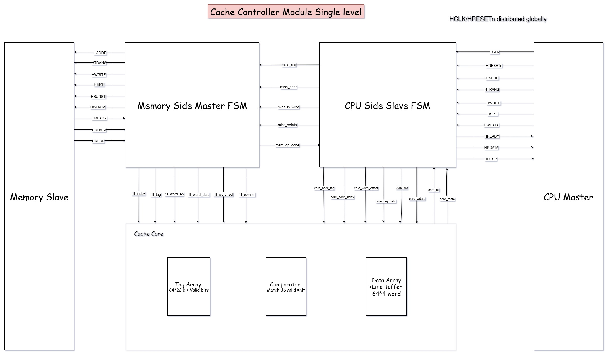
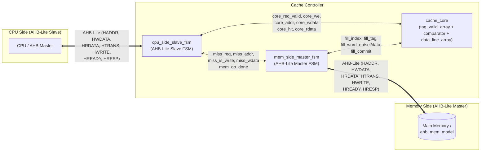
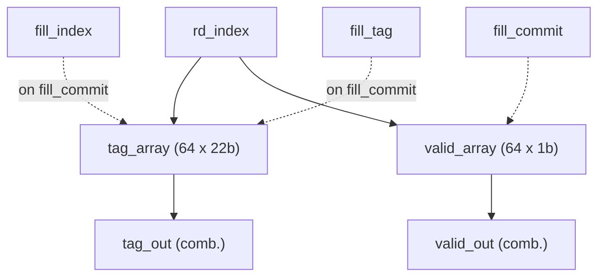
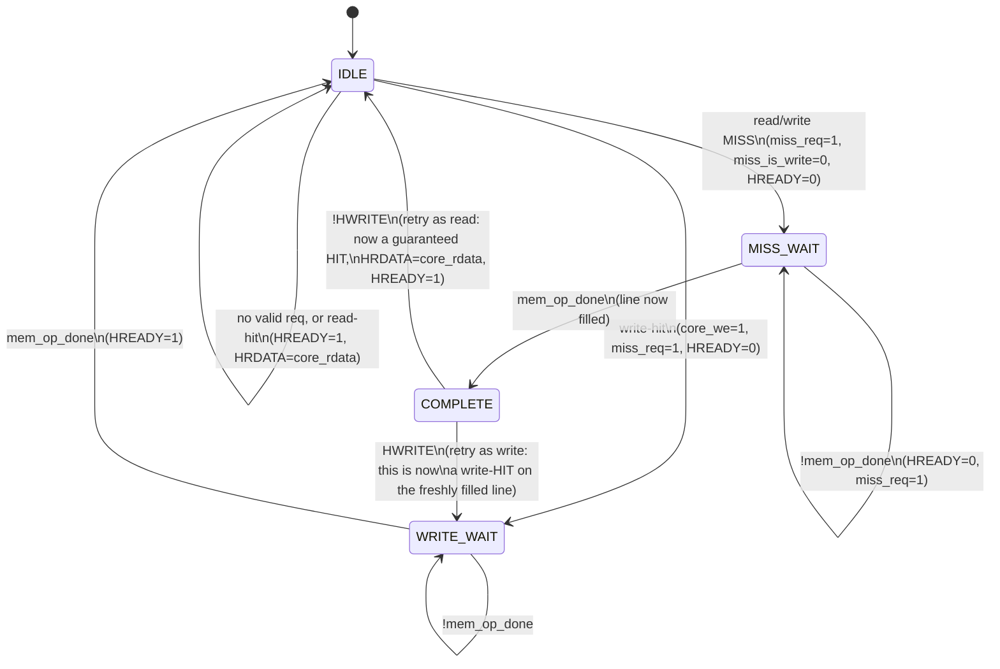
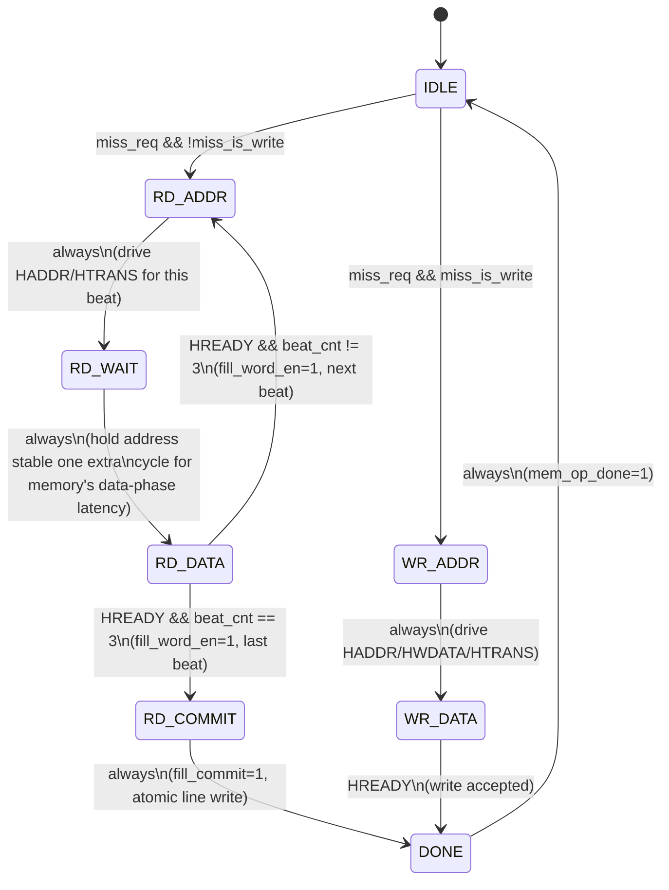
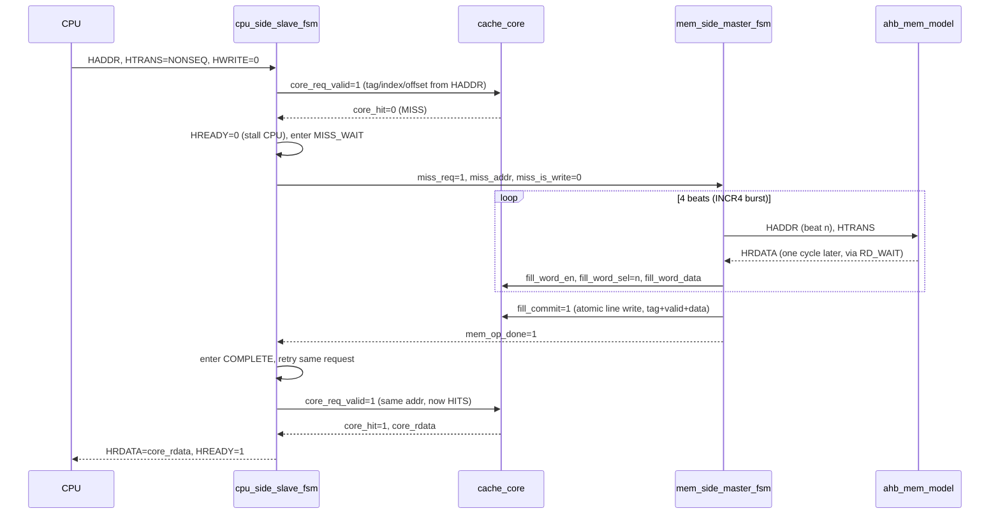
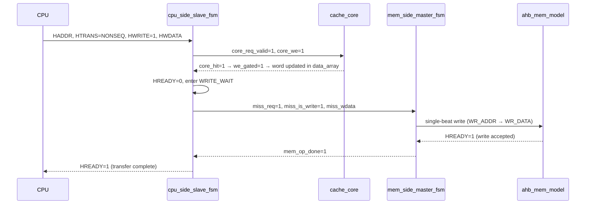
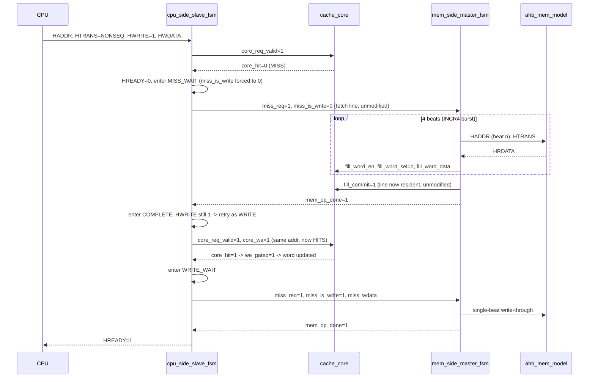

# AHB-Lite Direct-Mapped Cache Controller

Direct-mapped cache controller with AHB-Lite interfaces on both the
CPU-facing (slave) side and the memory-facing (master) side.

The cache sits transparently between a CPU and main memory: the CPU issues
standard AHB-Lite transfers exactly as it would to a memory-mapped slave,
and the controller decides internally whether to answer immediately from
the cache or to stall and fetch/write through to memory.

Correctness is verified two independent ways: **signal-level RTL
testbenches** in Verilog and a **transaction-level golden reference model** written from
scratch in Python (functional/spec-level cross-check). See
[Golden Reference Model (Independent Software Verification)](#golden-reference-model-independent-software-verification).

---

## Table of Contents

1. [Key Specs](#key-specs)
2. [Architecture Overview](#architecture-overview)
3. [Address Breakdown](#address-breakdown)
4. [Block-by-Block Design](#block-by-block-design)
   - [tag_valid_array](#1-tag_valid_array)
   - [comparator](#2-comparator)
   - [data_line_array](#3-data_line_array)
   - [cache_core](#4-cache_core-top-level-glue)
   - [cpu_side_slave_fsm](#5-cpu_side_slave_fsm)
   - [mem_side_master_fsm](#6-mem_side_master_fsm)
   - [ahb_mem_model](#7-ahb_mem_model-verification-only)
5. [FSM Deep Dives](#fsm-deep-dives)
6. [End-to-End Walkthroughs](#end-to-end-walkthroughs)
7. [Golden Reference Model (Independent Software Verification)](#golden-reference-model-independent-software-verification)
8. [Repository Structure](#repository-structure)
9. [Future Work](#future-work)

---

## Key Specs

| Parameter | Value |
|---|---|
| Organization | Direct-mapped |
| Total capacity | 1 KB |
| Line size | 16 bytes (4 × 32-bit words) |
| Number of lines | 64 |
| Write policy | Write-through, write to cache **on write-hit** |
| Write-miss policy | Write-allocate (fetches the full line into the cache on a write miss, then writes the word locally) |
| CPU-side interface | AHB-Lite slave |
| Memory-side interface | AHB-Lite master |
| HDL | Verilog-2001 (no SystemVerilog constructs) |
| Fill burst | 4-beat INCR4, one word per beat |

---

## Architecture Overview

The controller is composed of two independent AHB-Lite state machines
(one slave, one master) plus a cache storage core sandwiched between them.
Neither FSM ever touches memory arrays directly — all storage access is
mediated by `cache_core`.



*Full signal-level block diagram: `Memory Side Master FSM` and
`CPU Side Slave FSM` each expose a complete AHB-Lite port (to the memory
slave and CPU master respectively) and communicate with each other purely
through the internal `miss_req` / `miss_addr` / `miss_is_write` /
`miss_wdata` / `mem_op_done` handshake. Both FSMs drive `cache_core`
through separate, non-overlapping buses — the `core_*` request/response
bus from the CPU-side FSM, and the `fill_*` bus from the memory-side FSM —
so neither FSM can accidentally interfere with the other's access to
storage. `HCLK`/`HRESETn` are distributed globally to every sequential
block.*



**Why split into two FSMs instead of one?** Decoupling the CPU-facing
protocol from the memory-facing protocol means each FSM only has to be
correct for *one* AHB role (slave vs. master) at a time. `cpu_side_slave_fsm`
never drives a memory-side bus, and `mem_side_master_fsm` never talks to the
CPU. The two communicate through a small, purely internal handshake
(`miss_req` / `mem_op_done`), which keeps each state machine's state space
small and independently testable — this is exactly why `tb_cache_core.v`
can test the storage core in total isolation from both FSMs.

---

## Address Breakdown

A 32-bit CPU address is split into three fields used throughout the design:

```
 31                    10  9     4  3   2  1   0
┌────────────────────────┬────────┬──────┬──────┐
│         TAG (22)       │INDEX(6)│ WORD │ BYTE │
└────────────────────────┴────────┴──────┴──────┘
      bits[31:10]          bits[9:4] [3:2]  [1:0]
```

- **TAG** `[31:10]` (22 bits) — identifies which memory line currently
  occupies a cache slot.
- **INDEX** `[9:4]` (6 bits) — selects 1 of 64 cache lines (direct-mapped,
  so each index maps to exactly one line).
- **WORD OFFSET** `[3:2]` (2 bits) — selects 1 of 4 words within the
  16-byte line.
- **BYTE OFFSET** `[1:0]` — unused at the word-access granularity this
  controller supports (all accesses are 32-bit words).

This split is computed combinationally in `cpu_side_slave_fsm` from the live
`HADDR`, and independently recomputed in `mem_side_master_fsm` from its own
latched `addr_reg` during a fill. The same split is re-derived a third,
independent way in the Golden Reference Model's `split_address()` — see
[Golden Reference Model](#golden-reference-model-independent-software-verification).

---

## Block-by-Block Design

### 1. `tag_valid_array`

Stores the tag and valid bit for each of the 64 lines.

- **Read:** fully combinational — `tag_out` / `valid_out` reflect
  `tag_array[rd_index]` / `valid_array[rd_index]` with no clock edge
  in the path. This is what lets `comparator` produce a same-cycle hit/miss
  decision.
- **Write:** synchronous, and **only on `fill_commit`**. There is no
  separate "write tag on CPU write-hit" path, because a write-hit never
  changes which line is resident — only its data.
- **Reset:** all `valid_array` bits are asynchronously cleared to 0 on
  `rst_n` low. Tag contents are *not* reset (don't-care until valid is
  set), which is standard practice and saves reset fan-out.



### 2. `comparator`

Pure combinational hit/miss decision:

```verilog
assign hit = req_valid && (addr_tag == stored_tag) && valid;
```

All three conditions are mandatory:
- `req_valid` — gates hit to 0 whenever there's no live request, so stale
  tag/index values left on the bus from a previous cycle can never produce
  a false hit (verified directly in `tb_cache_core` Test 6).
- `addr_tag == stored_tag` — the actual tag match.
- `valid` — prevents an uninitialized/garbage tag from matching by chance
  right after reset (verified in Test 1, tag=0/index=0 is deliberately the
  "all-zeros" case that would falsely hit if this AND were missing).

### 3. `data_line_array`

Holds the actual 128-bit (4×32-bit) data for each of the 64 lines, plus a
single **line buffer** used to assemble an incoming fill line one word at a
time before it's committed atomically.

Three independent jobs happen in the same always block, each gated by its
own enable:

| Job | Trigger | Effect |
|---|---|---|
| Read | combinational, every cycle | `rdata = data_array[rd_index][word_offset]` |
| Write-hit | `we` (synchronous) | Updates **one word** of one line — the other 3 words are untouched |
| Fill accumulate | `fill_word_en` (synchronous) | Stages one word of the incoming burst into `line_buffer[fill_word_sel]` |
| Fill commit | `fill_commit` (synchronous) | Copies the **entire assembled `line_buffer`** into `data_array[fill_index]` in one atomic write |

The atomic commit (rather than writing each burst word directly into
`data_array`) is what guarantees a partially-received line is never visible
to a CPU read — the line only appears in `data_array` in the same cycle its
tag becomes valid.

### 4. `cache_core` (top-level glue)

Wires the three blocks above together and adds one safety measure: the
write-enable actually applied to `data_line_array` is **not** taken directly
from the FSM's `core_we`, but is re-gated locally:

```verilog
assign we_gated = core_we && core_hit;
```

This means even if `cpu_side_slave_fsm` ever asserted `core_we` without a
genuine hit (a bug elsewhere), `cache_core` cannot corrupt cache data on a
miss — it's a defensive, single-point-of-truth design choice rather than
trusting the caller.

### 5. `cpu_side_slave_fsm`

The AHB-Lite slave that the CPU talks to. Translates every CPU transfer into
a `cache_core` lookup, and on a miss, hands off to `mem_side_master_fsm` and
stalls the CPU (`HREADY = 0`) until the memory operation completes.

### 6. `mem_side_master_fsm`

The AHB-Lite master that talks to main memory. On a read miss it issues a
4-beat INCR4 burst to fetch the whole line and streams it into
`cache_core`'s line buffer; on a write it issues a single write-through
transfer.

### 7. `ahb_mem_model` (verification-only)

Not part of the deliverable RTL — a simple, fixed 1-cycle-latency AHB-Lite
slave memory model used purely to exercise the master FSM in
`tb_full_chain.v`. Included in the repo for reproducible simulation. Its
exact initialization pattern (`mem[i] = 0xCCCC_0000 + i`) is also
reproduced in the Golden Reference Model's `BackingMemory` class so that
both verification paths produce numerically comparable results — see
[Golden Reference Model](#golden-reference-model-independent-software-verification).

---

## FSM Deep Dives

### `cpu_side_slave_fsm` — CPU-Side AHB-Lite Slave FSM

**States:** `IDLE → (hit: single cycle) | (miss: MISS_WAIT/WRITE_WAIT → COMPLETE) → IDLE`



**How a miss is resolved — the "retry" pattern:**

The FSM does **not** special-case "return the freshly-fetched word to the
CPU directly from the fill path." Instead, once `mem_op_done` fires it
transitions to `COMPLETE` and simply **re-issues the original request
against `cache_core`** — which is now guaranteed to hit, because the line
was just filled. This is why:

- A **read miss** → `MISS_WAIT` → `COMPLETE` → re-checked as a read → now a
  hit → `HRDATA = core_rdata`, `HREADY = 1`, back to `IDLE`.
- A **write miss** → `MISS_WAIT` (the full line is fetched from memory
  first, exactly as a read-miss would be) → `COMPLETE` → since `HWRITE` is
  still 1, this is treated as a **write-hit** on the line that was just
  filled → transitions to `WRITE_WAIT` → the master FSM performs the
  write-through → `mem_op_done` → back to `IDLE`.

This "fetch-then-retry-as-hit" design is elegant because `cache_core` only
ever needs to implement one thing correctly (a hit path); misses are purely
a matter of making the retry succeed. **This is what makes the design
write-allocate**: a write-miss always pulls the full line into the cache
before applying the write, rather than writing straight through to memory
and bypassing the cache array. The `STATE_IDLE` miss branch always forces
`miss_is_write = 1'b0` toward the memory FSM regardless of the CPU's actual
`HWRITE`, guaranteeing the initial miss service is always a line fetch.

**Key combinational assignments (every cycle, before the case statement):**
```verilog
core_addr_tag    = HADDR[31:10];
core_addr_index  = HADDR[9:4];
core_word_offset = HADDR[3:2];
core_wdata       = HWDATA;
miss_addr        = HADDR;
miss_is_write    = HWRITE;
miss_wdata       = HWDATA;
```
**These are combinational, driven straight from live AHB inputs.**

---

### `mem_side_master_fsm` — Memory-Side AHB-Lite Master FSM

**States:** `IDLE, RD_ADDR, RD_WAIT, RD_DATA, RD_COMMIT, WR_ADDR, WR_DATA, DONE`



**Why `RD_WAIT` exists (the bug that was found and fixed):**

The original implementation sampled `HRDATA` in the very next cycle after
driving the address phase, which is one cycle too early for this bus
protocol — `HRDATA` is a **data-phase** signal that isn't valid until one
full clock cycle after the corresponding **address-phase** (`HADDR`/`HTRANS`)
is presented, per standard AHB-Lite two-phase pipelining. The fix inserts a
dedicated `RD_WAIT` state that holds the address/control signals stable for
one extra cycle before the FSM moves into `RD_DATA` and treats `HRDATA` as
valid for that beat. This is a textbook AHB pipelining trap: address phase
and data phase are staggered by one cycle, and any FSM that doesn't
explicitly account for that will silently sample stale or garbage data.

**Burst mechanics:**
- 4 beats total (`beat_cnt` 0→3), `HBURST = INCR4`, `HTRANS = NONSEQ` on the
  first beat and `SEQ` on the following three.
- `HADDR` for beat *n* = `line_base + (beat_cnt << 2)`, where `line_base`
  is the miss address with its byte/word-offset bits forced to zero
  (`{miss_addr[31:4], 4'b0000}`) — i.e., always the start of the 16-byte
  line, regardless of which word within the line triggered the miss. **The
  whole line is always fetched**, not just the missed word.
- Each beat's data streams into `cache_core`'s line buffer via
  `fill_word_en` / `fill_word_sel` (`= beat_cnt`) / `fill_word_data`
  (`= HRDATA`), and only after all 4 beats land does `RD_COMMIT` assert
  `fill_commit` to atomically publish the line.

**Write path:** simpler — a single-beat, non-burst write. `WR_ADDR` drives
`HADDR`/`HWDATA`/`HTRANS=NONSEQ`/`HWRITE=1` for one cycle, `WR_DATA` holds
those same values until `HREADY` confirms the memory accepted it, then
`DONE`.

---

## End-to-End Walkthroughs

### Walkthrough A — Read Miss



### Walkthrough B — Write Hit



### Walkthrough C — Write Miss (Write-Allocate)



Note the cache is updated **immediately** on a write-hit cycle, in parallel
with (not waiting for) the write-through to memory — this is standard for a
write-through cache and is why `core_we`/`we_gated` fire in the very same
cycle the hit is detected, independent of `miss_req`/`mem_op_done` timing.
On a write **miss**, that same write-hit behavior only happens after the
line has been fetched, as shown above — this fetch-first sequence is the
write-allocate policy, verified in `tb_cache_core.v` Test 7 ("write-miss at
index=10, tag=0x7").

---

## Golden Reference Model (Independent Software Verification)

In addition to the signal-level RTL testbenches (`tb_cache_core.v`,
`tb_full_chain.v`, `tb_cache_controller_top.v`), this project includes a
**golden reference model**: a transaction-level cache model written from
scratch in Python, in `Golden_Model/`. It exists to catch a class of bug
that self-checking RTL testbenches structurally cannot: if the same
engineer misunderstands the specification in the same way while writing
both the RTL and its testbench, the testbench will pass while quietly
checking the wrong thing. An independently-written model, built only from
the spec (address breakdown, line size, write policy) rather than by
reading the RTL's logic, has no reason to reproduce that same mistake.

This model does **not** replace the RTL testbenches — it deliberately
operates one level up. It has no notion of `HREADY` stalls, burst beats, or
FSM states; it only asks "if the CPU issues this read/write, what data
comes back, and what does memory end up holding?" Protocol-timing
correctness (the exact class of bug that `RD_WAIT` was added to fix) remains
the job of the signal-level RTL testbenches.

### How the model maps to the RTL

| RTL Concept | Reference Model Equivalent |
|---|---|
| `cpu_side_slave_fsm` hit/miss decision | `CacheModel._lookup()` |
| `cache_core` (tag_valid_array + comparator + data_line_array) | `CacheLine` dataclass + `CacheModel.lines[]` (64 entries) |
| `mem_side_master_fsm` 4-beat INCR burst fill | `CacheModel._fill_line()` (fetches all 4 words at once — burst timing itself is out of scope) |
| `mem_side_master_fsm` single-beat write-through | The memory-write step inside `CacheModel.do_write()` |
| `ahb_mem_model.v` backing memory + `0xCCCC_0000+i` init pattern | `BackingMemory` class (same init formula, for numerically comparable results) |
| `cpu_side_slave_fsm` `STATE_COMPLETE` (re-issue write after fill) | The fill-then-write-hit sequence inside `do_write()` |
| `HADDR` tag/index/word-offset slicing | `split_address()` |

### Running it

```bash
cd Golden_Model
python3 compare_with_rtl.py   # replays RTL test sequences, 12/12 pass
python3 stress_test.py        # 2,500 randomized ops, 0 mismatches
```

## Repository Structure

```
.
├── README.md                               # this file
├── LICENSE
├── filelist.f
├── run.do                                  # ModelSim/QuestaSim simulation script
├── wave.do                                 # Waveform signal groups 
│
├── Cache_Core/
│   ├── cache_core.v                        # Top-level glue for the 3 storage blocks
│   ├── comparator.v                        # Block 2: hit/miss decision
│   ├── data_line_array.v                   # Block 3: data storage + line buffer
│   └── tag_valid_array.v                   # Block 1: tag + valid storage
│
├── cache_controller_top.v                  # Top-level integration (the deliverable IP)
├── cpu_side_slave_fsm.v                    # AHB-Lite slave FSM (CPU-facing)
├── mem_side_master_fsm.v                   # AHB-Lite master FSM (memory-facing)
│
├── tb/
│   ├── tb_cache_core.v                     # Unit testbench for cache_core
│   ├── tb_full_chain.v                     # Full-chain integration testbench
│   ├── tb_cache_controller_top.v           # Top-level testbench
│   └── ahb_mem_model.v                     # Verification-only memory model
│
├── Golden_Model/                           # Independent Python verification model
│   ├── cache_reference_model.py            # The golden model (BackingMemory, CacheLine, CacheModel)
│   ├── compare_with_rtl.py                 # Scoreboard: replays RTL test sequences
│   ├── compare_with_rtl_output.log         # Captured output (12/12 checks pass)
│   ├── stress_test.py                      # Randomized invariant test (2,500 ops)
│   └── stress_test_output.log              # Captured output (0/2,500 mismatches)
│
└── docs/
    ├── Architecture.jpg                    # Full signal-level block diagram (shown above)
    ├── Golden_Model_Report.docx            # Full write-up of the golden model
    └── Direct-Mapped Cache Controller with an AHB-Lite Interface.pdf  # Formal NTI report
```

---

## Future Work

- **L2 cache.** Explicitly scoped out of this project 
- Multi-word burst support for CPU-side transfers (currently single-word
  AHB-Lite transfers only).
- Configurable associativity (set-associative extension) as a follow-on
  architecture exercise.
- HRESP error responses (SPLIT/RETRY/ERROR) for fuller AHB-Lite compliance.

---

